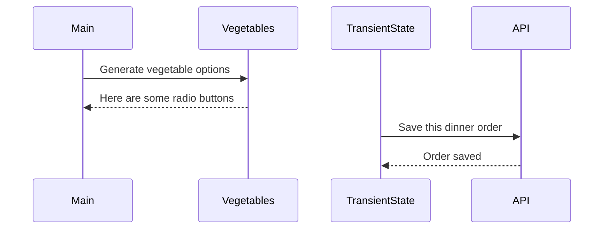

# Events and State Self-Assessment

> 🧨 Make sure you answer the vocabulary and understanding questions at the end of this document before notifying your coaches that you are done with the project

## Setup

1. Make sure you are in your `workspace` directory
1. `git clone {github repo SSH string}`
1. `cd` into the directory it creates
1. `code .` to open the project code
1. Use the `serve` command to start the web server
1. Open the URL provided in Chrome

## Requirements

### Initial Render

1. All 10 base dishes should be displayed as radio input options.
1. All 9 vegetables should be displayed as radio input options.
1. All 6 side dishes should be displayed as radio input options.
1. All previously purchased meals should be displayed below the meal options. Each purchase should display the primary key and the total cost of the purchased meal.

### State Management

1. When the user selects an item in any of the three columns, the choice should be stored as transient state.
1. When a user makes a choice for all three kinds of food, and then clicks the "Purchase Combo" button, a new sales object should be...
    1. Stored as permanent state in your local API.
    1. Represented as HTML below the **Monthly Sales** header in the following format **_exactly_**. Your output will not have zeroes, but the actual amount.
        ```html
        Receipt #1 = $00.00
        ```
   1. The user's choices should be cleared from transient state once the purchase is made.

## Design

Given the description and animation above...

1. Create an ERD for this application before you begin.
1. Make a list of what modules need to be created to make your application as modular as possible. Create a **Dependency Graph** for the project to be reviewed once you are complete with the assessment.
1. Create a **Sequence Diagram** that visualizes what your algorithm is for this project. We'll give you a minimal starting point.



## Vocabulary and Understanding

> 🧨 Before you click the "Assessment Complete" button on the Learning Platform, add your answers below for each question and make a commit. It is your option to request a face-to-face meeting with a coach for a vocabulary review.

1. Should transient state be represented in a database diagram? Why, or why not?

   > No because transient state is temporary data that just lives in memory when a user is interacting with the UI. Now it could be added as permanent state like we did here, but then we're talking about creating a new table in the ERD since it will be staying in the database.

2. In the **FoodTruck** module, you are **await**ing the invocataion of all of the component functions _(e.g. sales, veggie options, etc.)_. Why must you use the `await` keyword there? Explain what happens if you remove it.

   > We use the await keyword because we are using the async keyword on the component functions, and we need to tell JavaScript to wait for the data to come back before continuing onto the next line. If we remove the await keyword, then the Promise is returned and it won't be our actual data. It will say something like [Promise, object].

3. When the user is making choices by selecting radio buttons, explain how that data is retained so that the **Purchase Combo** button works correctly.

   > I set the initial values for the entreeId, vegetableId, and sideId to null, representing no selection has been made yet, for the transientState. After the user makes their selections from the radio buttons in each section, the data values from each button is stored in memory and by clicking the Purchase Combo button, the current values in transientState (selected radio buttons) are used to create an object that is then sent to the database as permanent state.

4. You used the `map()` array method in the self assessment _(at least, you should have since it is a learning objective)_. Explain why that function is helpful as a replacement for a `for..of` loop.

   > Since we are working with an API/DB that means we are likely working with arrays, so using .map is the go-to way of transforming objects from those arrays and putting them into a new array instead of having to make an empty array and use for..of loops to iterate over and push into the empty array. .map() handles all that. It's cleaner code, easier readability.
